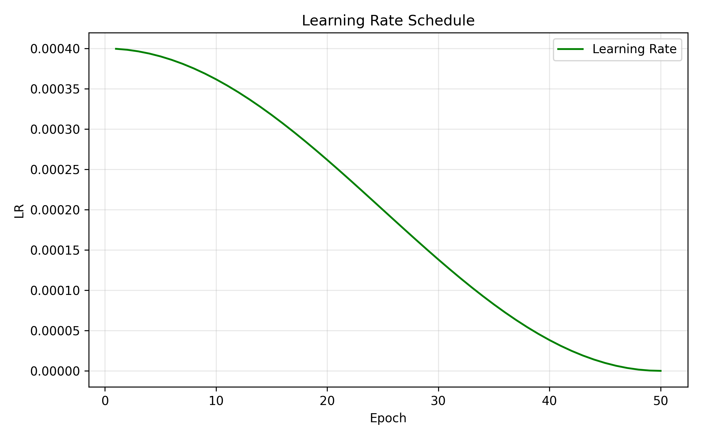
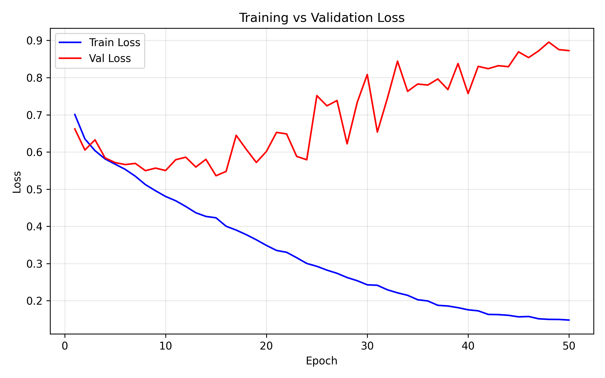

# ADNI MRI data ConvNeXt Classifier 
### Table of Contents
1. [Overview](#overview)
2. [Dependencies](#dependencies)
3. [Structure](#structure)
4. [Dataset](#dataset)
   - [Creation of Validation Dataset](#creation-of-valedation-dataset)
5. [Model Architecture](#model-architecture)
   - [ConvNeXt Block](#convnext-block)
   - [Custom ConvNeXt Implementation](#custom-convnext-implementation)
6. [Training](#training)
   - [Hyperparameters](#hyperparamters)
   - [Augmentation](#augmentation)
     - [Training Transformation](#training-transformation)
     - [Test Transformation](#test-transformation)
   - [Training Configuration](#training-configuration)
7. [Usage](#usage)
8. [Results](#results)
9. [Inference](#inference)
10. [References](#references)

---

## Overview

The problem at hand was the classification of MRI brain scan images in the ADNI dataset; this dataset contains sliced MRI brain scans, labeled Alzheimer's disease (AD) and normal control (NC). For this, a ConvNeXt classification model was implemented. This is a convolutional network adapted from ResNet50 and the Swin Transformer. This allows the model to improve over the ResNet50 in image recognition tasks and led to it being implemented for tasks such as medical imaging classification. Using this, a model was implemented to achieve 77.23% accuracy on the test set.

## Dependencies
- Python 3.12.7
- numpy==2.3.3
- pandas==2.3.3
- matplotlib==3.10.7
- scikit-learn==1.7.2
- scipy==1.16.2
- torch==2.9.0
- torchvision==0.24.0
- tqdm==4.67.1

Install all dependencies with:

```pip install -r requirements.txt ```

## Structure

```
PatternAnalysis-2025/recognition/
└── convnext_47433117/
    ├── dataset.py
    ├── modules.py
    ├── train.py
    ├── predict.py
    ├── requirements.txt
    ├── images/
    ├── ADNI/AD_NC/
    │   ├── test/
    │   └── train/
    └── README.md
```
## Dataset

The ADNI (Alzheimer's Disease Neuroimaging Initiative) dataset is a public dataset aimed for use in Alzheimer's research. It is provided through the LONI Image and Data Archive, from the portal at https://adni.loni.usc.edu/data-samples/adni-data/ 

This dataset provides grayscale, 256 × 240 pixel, T1w MRI images categorized into Alzheimer's Disease (AD) and Normal Control (NC) groups; with an example of each class shown below. These images have been split into Train and Test sets, with each image following the filename structure `patient_index.png`, allowing the images to be split per patient to avoid data leakage between groups. The statistics of the dataset are included in the table below.

| Figure 2: Example AD Image | Figure 3: Example NC Image |
|----------------------------|----------------------------|
|  |  |


 
**Table 1: ADNI Dataset Split**
| Dataset Split  | AD Images | NC Images | Total Images |
|----------------|-----------|-----------|--------------|
| **Train**      | 10,400    | 11,120    | 21,520       |
| **Test**       | 4,460     | 4,540     | 9,000        |
| **Total**      | 14,860    | 15,660    | 30,520       |

This has been warpped in the custome data loader `ADNI_Loader` in `dataset.py`

### Creation of Valedation Dataset

To follow the correct training, a valedation set was made to measure the accuracy of the model during training, and be used to tweak the hyper-parameters. To ensure there is not data leakage, the training data was split on a patient messure, ensuring that no patients data ended up in both the valedation set and train set, boosting metrics when overfitting. It was chosen to only use 10% of the data as a valedation set, as the dataset was already small, loosing too many patients would ensure the model would memorise the training set, or not have enough information to train.


## Model Architecture

ConvNeXt is a modern convolutional neural network that builds on standard CNNs while incorporating design principles inspired by the Swin Transformer. The core building block of ConvNeXt is a depthwise 7×7 convolution, which efficiently captures spatial context across a large receptive field while preserving spatial dimensions through padding. Additionally, the model uses GELU activations instead of ReLU and LayerNorm in place of Batch Normalization, making it more suitable for complex image classification tasks. [3]

The full ConvNeXt model can be seen below:


### ConvNeXt Block
The ConvNeXt block is an adapted ResNet50 block, inspired by the Swin Transformer, and is defined as seen below:
 [1]

### Custom ConvNeXt implementation

Using this base model, a custom class was adapted for the ADNI dataset, modifying the feature channels, and adding dropout and layer scaling to prevent overfitting on the relatively small MRI dataset. This model was adapted from the ConvNeXt-small model, with roughly 50M parameters. This was in order to find a balance between the model not identifying important patterns, as seen in tests of ConvNeXt-tiny, and overfitting.

Custom functions were written to replace timm `trunc_normal_` and `DropPath`, with the final model ConvNeXt in `modules.py` following the below architecture:

```custom_small(drop_path_rate=0.15, layer_scale_init_value=1e-6, head_init_scale=1, classifier_dropout=0.3)```

Stem
- 4×4 Conv2d, stride 4.
- LayerNorm: stabilize input features.

ConvNeXt Block
- 7×7 depthwise convolution (Conv2d(groups=dim)) to capture spatial context.
- Permute to channels-last (N,H,W,C) for LayerNorm.
- LayerNorm across channels.
- Permute back to channels-first (N,C,H,W).
- 1×1 pointwise convolution
- GELU → 1×1 pointwise convolution.
- Layer scale.
- Custom DropPath (stochastic depth).
- Residual connection.

Final Layer
- Global average pooling.
- LayerNorm.
- Dropout (0.3) for regularization.
- Linear classifier to 2 classes (AD vs NC).

ConvNeXt custom_small Flow
- Stem
- Stage 1: 3× ConvNeXt Block, 96 channels
- Stage 2: Downsample (2×2 Conv) → 3× ConvNeXt Block, 192 channels
- Stage 3: Downsample → 9× ConvNeXt Block, 384 channels
- Stage 4: Downsample → 3× ConvNeXt Block, 768 channels
- Final Layer


## Training

The final model was trained on the test data as follows in `train.py` , it was trained on a 2070 super. The final hyperparameters for the training loops were found through experementation, it was found that the model either did not capute the features, hardly reaching 65\% valedation accuracy after 100 test epochs, or rapidly overfit the model. A sweet spot was found, by using increased test data augmentations and other regulirasation methods to counteract overfitting. Using this, models tended to reach conversion after just 30 epochs, though could be subject to overfitting after this.

### Hyperparamters

While the model's values were chosen through tests and analysis of the data, the learning hyperparamters still had to be tuned and tested to allow for the model to learn well.

Table 2: Learning Hyperparameters
| Hyperparamters | Value |
| ----- | ----- |
|**batchSize**|32|
|**epochs**|50|
|**learningRate**|2e-4|
|**weightDecay**|0.05|
|**drop_path_rate**|0.2|

A Batch Size of 32 was chosen to balance the batch normalization, against the computing limitations. This allowed for the normalisation samples to have enough data to not be skwed, while still allowing full Vram utalisation for fast training.

50 Epochs were chosen, as from tests, validation loss and accuracy did not seem to improve drastically past 40 epochs, while usally test results would continue to increase as the model jsut started to 'memorise' the data.

A learning rate of 2e-4 or 0.0002 was chosen as it provided a solid middle groud between extreme volitility of higher learning rates, and the usaual stagnation of extermely low earning rates for the ADNI data.

A Weight Decay of 0.05 was used to help prvent overfitting, by penalising large weights int he loss function and gradient descent. [2]

A Drop path of 0.2 was chosen in an aim to further counterat the model overfitting the test data. This dropped 20\% of the connections forcing the model to not focus on specific connections and learn of feature. [2]

These Hyperparemters seemed to produce the best results from testing, finding a balnce between overfitting and model stagnatation in the learning process.

### Augmentation 
#### Training transformation
The training data was passed through some transformations first. This was done as all training images were quite homogeneous, and with the relatively small training set compared to the dataset ConvNeXt was originally trained for, this lead to high levels of overfitting on simples transforms to reshape the data. In an effort to counteract this overfitting, a very agressive transform was also tested. However, this was found to be counter productive as it would hinder the training for the model and keep the accuracy below 65\%. Using these tests, a moderate transformation was created, as it allowed to keep the delicate shapes and patterns of the MRI data without allowing the model to memorise specific pixel values. [2]

Table 3: Training transformation configuration used
| Argument | Value |
| ----- | ----- |
|**Grayscale**| num_output_channels=3 |
|**Resize**| 224x224|
|**RandomResizedCrop**|224, scale=(0.9, 1.0)|
|**RandomAffine**|degrees=5, translate=(0.05, 0.05), scale=(0.95, 1.05)|
|**RandomHorizontalFlip**|p=0.5|
|**ColorJitter**|brightness=0.15, contrast=0.15|
|**Normalize**|mean=[0.5, 0.5, 0.5], std=[0.5, 0.5, 0.5]|

Grayscaling to 3 channels was applied to transform the image into a 'psuedo-RGB' image, as used in the original ConvNeXt paper, in order to allow the model to extract more information from the input image.

Resize was applied to reshape the image to 224x224 to scale better with the pareamteres of the ConvNeXt model.

RandomResizedCrop was applied to to this image then scaled back to 224x224, as it keeps 90% of the image still, this was used to move the brain section of the MRI off centre in hopes the model would memorise shapes of the data not pixel locations.

RandomAffine was applied to slightly alter the image while keeping the shape of the data. Degrees=5 rotates the image $\in [-5^{\circ}, 5 ^{\circ}]$, translate=(0.05, 0.05) shifted the image vertically or horizontally within a 5\% range based on the width and height, and scale=(0.95, 1.05) zoomed the image within 5% of the original image, while keeping the 244x244 shape.

RandomHorizontalFlip was applied to flip the image horazontally 50\% of the time.

ColorJitter was applied to slightly chnage the range of the greyscale channels, brightness=0.15 randomly scaled all pixel values within 15\%, and contrast=0.15 randomly scaled the contrast of the image within 15\%. This effectively moved and scaled the pixel values fo prevent the model from just learning intenisties.

Finally, Normalize was use to bring all channels back to a mean and standard deviation of 0.5.

#### Test Transformation

As the format of the MRI data was altered to better suite the ConvNeXt model, the test data also had to be transformed. These transforms were simple, and were just done to give the best chance of the model classifying the test images.

Table 4: Test transformation configuration used
| Argument | Value |
| ----- | ----- |
|**Grayscale**| num_output_channels=3 |
|**Resize**| 224x224|
|**Normalize**|mean=[0.5, 0.5, 0.5], std=[0.5, 0.5, 0.5]|

### Training Configuration

To train the model, fee configriable settings were chosen to give the model the best chance of reaching a high accuracy. 

```criterion = nn.CrossEntropyLoss(label_smoothing=Config.labelSmoothing) ```

This is the most common loss function for multi-class classification tasks, measuring performance of a classification model whose output is a probability distribution over C classes. It was chosen due to its reliability and proir use in ConvNeXt training, inidcating relieable results.
Labale Smoothing was used as a regularization technique to discourage overconfidence, by altering a hard target label (binary) to a soft target label (porbabilistic), and was used to battle overfitting in the model.

```optimizer = torch.optim.AdamW(model.parameters(), lr=Config.learningRate, weight_decay=Config.weightDecay)```

This is an an improved version of the Adam optimizer that decouples the weight decay term from the gradient update, which generally leads to better performance, especially in models with many parameters. The Learning Rate (lr) determines the step size taken in the direction of the negative gradient during optimization, and the weight_decay adds another regularization term (L2 regularization) that penalizes large weights in the model; This was done to help prevent overfitting.

```scheduler = CosineAnnealingLR(optimizer, T_max=Config.epochs)```

This learning rate scheduler was used to gradually decreases the learning rate from the initial value to almost zero following a cosine curve over the duration of the training, as specified by T_max, allowing the model to take smaller steps the closer it gets to the local minima during optimization.

### Usage

To run the learning script, use
```
python train.py --data_root <path to data root folder> --save_dir <path to checkpoints folder> 
```

## Results

Using the above defined model in `modules.py` and the training script in `train.py`, the model was able to predict a 77.03\% accuracy on the test data set, the model was produced after x epochs, after which, the valedation loss stagnated and started to fall, while the test loss continued to rise. This suggests the model was overfitting despite the harsh regularization and training transforms. Whilst the model overfit the training data, it produced the best accuracy of other models, where harsh regularisation prevent the model from overfitting; this suggests the regularization techinuques were loosing information from the original images. A summary of the best model can be found below.

### Additional performance metrics:  
| Class | Precision | Recall | F1-score | Support |
|:------|-----------:|--------:|----------:|---------:|
| **AD** | 0.88 | 0.62 | 0.73 | 4460 |
| **NC** | 0.71 | 0.91 | 0.80 | 4540 |
| **Accuracy** |  |  | **0.77** | 9000 |
| **Macro Avg** | 0.79 | 0.77 | 0.77 | 9000 |
| **Weighted Avg** | 0.79 | 0.77 | 0.77 | 9000 |

### Confusion Matrix:
| True\Pred | AD    | NC    |
|-----------|-------|-------|
| AD        | 2784  | 1676  |
| NC        | 390   | 4150  |

From this, it can be seen that the model has high precision for the NC class, accurately predicting in 91\% of the time, but struggles with the AD class.

| Learning curve |Loss Curve|
|-----------|-------|
|||

As it can be seen here, after 15 epochs the model starts to overfit, however, the best model was not produced untill epoch 30, indicating that the model was still learning features during the early stages of overfitting. In an effort to reduce this overfitting, harsher regularization and image transformations were used. however, while stopping overfitting, these seemed to impact the valedation accuracy and even after 100 epochs, did not produce a better result than the overfitted model.

## Inference

To run a full test script from the PatternAnalysis-2025 root:
On windows,
```
python3.12 -m venv venv
venv\Scripts\Activate.ps1
```
on mac / linux
```
python3.12 -m venv venv
source venv/bin/activate
```
Download requirments
```
pip install -r recognition/convnext_47433117/requirements.txt
```
Train the model
```
python recognition/convnext_47433117/train.py --data_root recognition/convnext_47433117/ADNI/AD_NC --save_dir recognition/convnext_47433117/checkpoints
```
Use the model 
```
python recognition/convnext_47433117/predict.py --data_root recognition/convnext_47433117/ADNI/AD_NC --model_path recognition/convnext_47433117/checkpoints/best_model.pth
```

## Further improvements

Further improvements could be made to this by using the ConvNeXt v2 model this model uses a VAE encoder, based on a ConvNeXt‑Tiny, to build a latent space that is tailored to dermatology rather than natural‑image features, this is then frozed and used as the feature extractor for the images. This allows models trained from scratch ratrher than pretrained ones, while counteracting overfitting, if the task did not force the ConvNeXt v1, this would be a better suited model for the task. [4]
## References

[1] GeeksforGeeks. “ConvNeXt.” GeeksforGeeks, 15 Jul. 2025, https://www.geeksforgeeks.org/computer-vision/convnext/

[2] Google. (2025, August 25). ML Practicum: Image Classification – Preventing Overfitting. Google Developers. https://developers.google.com/machine-learning/practica/image-classification/preventing-overfitting?utm_source=chatgpt.com

[3] Liu Z., Mao H., Wu C‑Y., Feichtenhofer C., Darrell T., Xie S. “A ConvNet for the 2020s”, arXiv:2201.03545. URL: https://arxiv.org/pdf/2201.03545

[4] Matas, I., Serrano, C., Nogales, M., Moreno, D., Ferrándiz, L., Ojeda, T., & Acha, B. (2025). Mitigating Overfitting in Medical Imaging: Self‑Supervised Pretraining vs. ImageNet Transfer Learning for Dermatological Diagnosis (arXiv preprint arXiv:2505.16773). Retrieved from https://arxiv.org/abs/2505.16773
