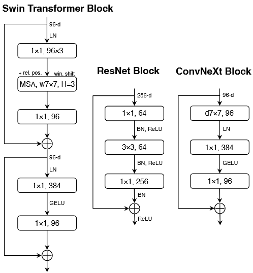
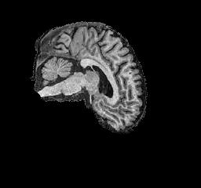

# Classifier for ADNI brain data based on the ConvNeXt

**Table of Contents**

## Overview

The problem at hand was the classification of MRI brainscan images in the ADNI dataset; this dataset contains sliced MRI brain scans, labeled Alzheimer's disease (AD) and normal control (NC). For this, a ConvNeXt classification model was implemented, this is a convolutional network adapted from ResNet50 and the Swin Transformer. This allows the model to improve over the ResNet50 in image recognitions tasks and led to it being implemented for tasks such as medical imaging classifaction. Using this, a model was implemented to acheive xx accuracy on the test set.

## Model Architecture

## Dataset

The ADNI (Alzheimer's Disease Neuroimaging Initiative) dataset is a public dataset, aimed for use in Alzheimer's  research. It is provided through the LONI Image and Data Archive, from the portal at https://adni.loni.usc.edu/data-samples/adni-data/ 

This data set provides grayscale, 256 x 240 pixel, T1w MRI images categorized into Alzheimer's Disease (AD) and Normal Control (NC) groups; with an example of each class shown below. These images have been split into Train and Test sets, withe each image following the filename structre `patient_index.png`, allowing the images to be split per patient to avoid data leakage between groups. The statistics of the dataset have been included in the table below.

| Figure 2: Example AD Image | Figure 3: Example NC Image |
|----------------------------|----------------------------|
|  |  |

 
Table 1: ADNI Dataset Split
| Dataset Split  | AD Images | NC Images | Total Images |
|----------------|-----------|-----------|--------------|
| **Train**      | 10,400    | 11,120    | 21,520       |
| **Test**       | 4,460     | 4,540     | 9,000        |
| **Total**      | 14,860    | 15,660    | 30,520       |

## Training

### Augmentation 

The training data was passed through some transformations first. This was done as all training images were quite homogeneous, and with the relatively small training set compared to the dataset ConvNeXt was originally trained for, this lead to high levels of overfitting on simples transforms to reshape the data. In an effort to counteract this overfitting, a very agressive transform was also tested. However, this was found to be counter productive as it would hinder the training for the model and keep the accuracy below 65\%. Using these tests, a moderate transformation was created, as it allowed to keep the delicate shapes and patterns of the MRI data without allowing the model to memorise specific pixel values.

The training transformation configuration used is as follows:  
| Argument | Value |
| ----- | ----- |
|**Grayscale**| (num_output_channels=3 |
|**Resize**| 224x224|
|**RandomResizedCrop**|224, scale=(0.95, 1.0)|
|**RandomAffine**|degrees=5, translate=(0.02, 0.02), scale=(0.95, 1.05)|
|**RandomHorizontalFlip**|p=0.5|
|**ColorJitter**|brightness=0.1, contrast=0.1|
|**Normalize**|mean=[0.5, 0.5, 0.5], std=[0.5, 0.5, 0.5]|

Grayscaling to 3 channels was applied to transform the image into a 'psuedo-RGB' image, as used in the original ConvNeXt paper, in order to allow the model to extract more information from the input image.

Resize was applied to reshape the image to 224x224 to scale better with the pareamteres of the ConvNeXt model.

RandomResizedCrop was applied to to this image then scaled back to 224x224, as it keeps 95% of the image still, this was used to move the brain section of the MRI off centre in hopes the model would memorise shapes of the data not pixel locations.

RandomAffine was applied to slightly alter the image while keeping the shape of the data. Degrees=5 rotates the image $\in [-5^{\circ}, 5 ^{\circ}]$, translate=(0.02, 0.02) shifted the image vertically or horizontally within a 2\% range based on the width and height, and scale=(0.95, 1.05) zoomed the image within 5% of the original image, while keeping the 244x244 shape.

RandomHorizontalFlip was applied to flip the image horazontally 50\% of the time.

ColorJitter was applied to slightly chnage the range of the greyscale channels, brightness=0.1 randomly scaled all pixel values within 10\%, and contrast=0.1 randomly scaled the contrast of the image within 10\%. This effectively moved and scaled the pixel values fo prevent the model from just learning intenisties.

Finally, Normalize was use to bring all channels back to a mean and standard deviation of 0.5.

## Results

## Usage

## Refrences
